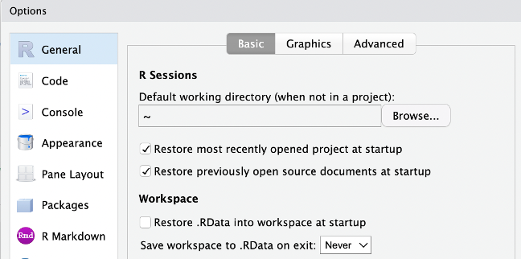

# Introduction to reproducible data analysis with R and Quarto

The materials made available here are not intended as a standalone educational product. The intended use scenario is with a course leader walking through the materials, adding information to what is on the slides and the data import/analysis files, and interacting with course participants.

With that said, you can browse the content and see if you find it useful. See the section [Structure](https://github.com/pgmj/RstudioQuartoIntro#structure) below.

## Preparations

Install R (you need version 4.1 or later) for your platform: 

- Windows: <https://ftp.acc.umu.se/mirror/CRAN/bin/windows/base/R-4.3.0-win.exe> 
- Mac: <https://ftp.acc.umu.se/mirror/CRAN/bin/macosx/> 
- Others, see: <https://ftp.acc.umu.se/mirror/CRAN/>

Install the latest version of Rstudio, which includes Quarto 1.2: - <https://posit.co/download/rstudio-desktop/>

> **Note:** If you have an older version of R (not Rstudio) and need to upgrade, you may find that the easiest way is to uninstall R and reinstall everything including packages from scratch. Unfortunately, it is not sufficient to use the regular uninstall functions, but you will find instructions on removal here: https://www.delftstack.com/howto/r/uninstall-r-and-all-its-packages-on-windows/


### Rstudio settings

Start up Rstudio, and go to `Tools -> Global options`. In the window that appears, make sure your settings match those in the image below. You do not want to save or restore workspace .RData - ever.



If you like, you can change the visual theme under the `Appearance` tab.

### Installing R packages

Below is a list of all the packages planned for use during the course. In Rstudio, in the bottom right quadrant (under the tab "Files"), create a "New Blank File" of type "R script". Then copy & paste the code below into the new file, or just run it from the *Console* tab in Rstudio.

```
install.packages(c("ggrepel","formattable","kableExtra","ggdist","ggrain",
                   "modelsummary","mice","GGally","easystats","patchwork",
                   "ggplot2","broom.mixed","nlme","lme4","psych","janitor",
                   "lubridate","skimr","car","styler","grateful","arrow","glue",
                   "showtext","readxl","foreign","tidyverse","visdat",
                   "gtsummary","scales","marginaleffects","ggeffects",
                   "sjPlot"))
```

And for convenience here are the packages in another format, with some brief explanations.

```
# these are mostly for data management/wrangling and visualization
library(tidyverse) # for most things
library(foreign) # for reading SPSS files
library(readxl) # read MS Excel files
library(showtext) # get fonts
library(glue) # simplifies mixing text and code in figures and tables
library(arrow) # support for efficient file formats
library(grateful) # create table+references for packages used in a project
library(styler) # only a one-time installation (it is an Rstudio plugin)
library(car) # for car::recode only
library(skimr) # data skimming
library(lubridate) # for handling dates in data
library(janitor) # for many things in data cleaning

# these are mostly for data analysis and visualization
library(gtsummary)
library(scales)
library(visdat)
library(psych)
library(lme4)
library(nlme)
library(broom.mixed)
library(ggplot2)
library(patchwork)
library(easystats)
library(GGally)
library(mice)
library(modelsummary)
library(ggrain)
library(ggdist)
library(kableExtra)
library(formattable)
library(ggrepel)
library(marginaleffects)
library(ggeffects)
library(sjPlot)
```

### Getting all the course files

There is a zip file with all the course files:

- <https://github.com/pgmj/RstudioQuartoIntro/blob/main/RstudioQuartoIntro.zip>
- Click the downward arrow button to the far right to download the file

Make sure that you extract the zip file into a folder.

> **Note:** Windows users beware of double-clicking the file since this may open the zip file in a way that looks like it already is a folder. Either right-click the file and select "Extract to..." or make sure to click the Extract button if you did double-click the file.

#### Using git

If you want to, you can to install Git and clone the repository instead. Download links: <https://git-scm.com/downloads>

Then you are going to "clone" this code repository to a folder on your
computer. There are two ways to go about this. Either you start up a terminal/shell/command prompt and navigate to where you would like to put the folder (a subfolder will automatically be created) and run the command `git clone https://github.com/pgmj/RstudioQuartoIntro.git`, or you can use a [graphical user interface for git](https://git-scm.com/downloads/guis). I have no experience with the GUI, so you will have to figure that out for yourself.

If you are new to navigating a file system with a terminal/shell/command prompt, here are some links that I hope are useful:

- MacOS: 
  - <https://www.macworld.com/article/221277/command-line-navigating-files-folders-mac-terminal.html>
  - <https://wiki.communitydata.science/MacOS_terminal_navigation>
- Windows: 
  - <https://www.howtogeek.com/659411/how-to-change-directories-in-command-prompt-on-windows-10/>


## Structure

The core course files are the [Quarto](https://quarto.org) `*.qmd` files in the root directory of the repository. Rendered revealjs/HTML outputs from the .qmd files are available in the `/docs` folder and hosted with GitHub Pages. You can reach them directly at 

- <https://pgmj.github.io/RstudioQuartoIntro/start.html>
- <https://pgmj.github.io/RstudioQuartoIntro/data_import.html>
- <https://pgmj.github.io/RstudioQuartoIntro/data_analysis.html>

All code is also available in the HTML-files. You should be able to re-create the HTML files from the .qmd files.

## Credits

The datasets used:
Mindfulness-integrated cognitive behaviour therapy (MiCBT) randomised controlled trial dataset.xlsx. (2020). [Data set]. Monash University. https://doi.org/10.26180/13240304

And for questionnaire item data: https://pgmj.github.io/PreventOSA/
With the data file available here: https://github.com/pgmj/PreventOSA/tree/main/data

Thanks to [Emil Hvitfeldt](https://github.com/EmilHvitfeldt) for blog posts on revealjs design and the use of iframes.

## Additional materials for the curious

It is not expected that you look at these before starting the course.

[Hadley Wickham's book "R for data science"](https://r4ds.hadley.nz/) is a great place to learn about R, no matter which level of prior knowledge you possess.

For a nice collection of helpful materials on *"research design, causal inference, and econometric tools to measure the effects of social programs"*, see <https://evalsp23.classes.andrewheiss.com/>

## Author

[Magnus Johansson](https://www.ri.se/en/person/magnus-p-johansson) is a licensed psychologist with a PhD in behavior analysis from [Oslo Metropolitan University](https://www.oslomet.no/en/study/hv/behaviour-analysis-phd). He works as a research scientist at [RISE Research Institutes of Sweden](https://ri.se/en), Department of Measurement Science and Technology, and is an affiliated researcher at [Karolinska Institutet](https://medarbetare.ki.se/orgid/52082137). 
- Twitter: [\@pgmjoh](https://twitter.com/pgmjoh) 
- ORCID: [0000-0003-1669-592X](https://orcid.org/0000-0003-1669-592X) 
- Mastodon: [\@pgmj\@scicomm.xyz](https://scicomm.xyz/@pgmj)

## License

This work is licensed under the MIT License.
